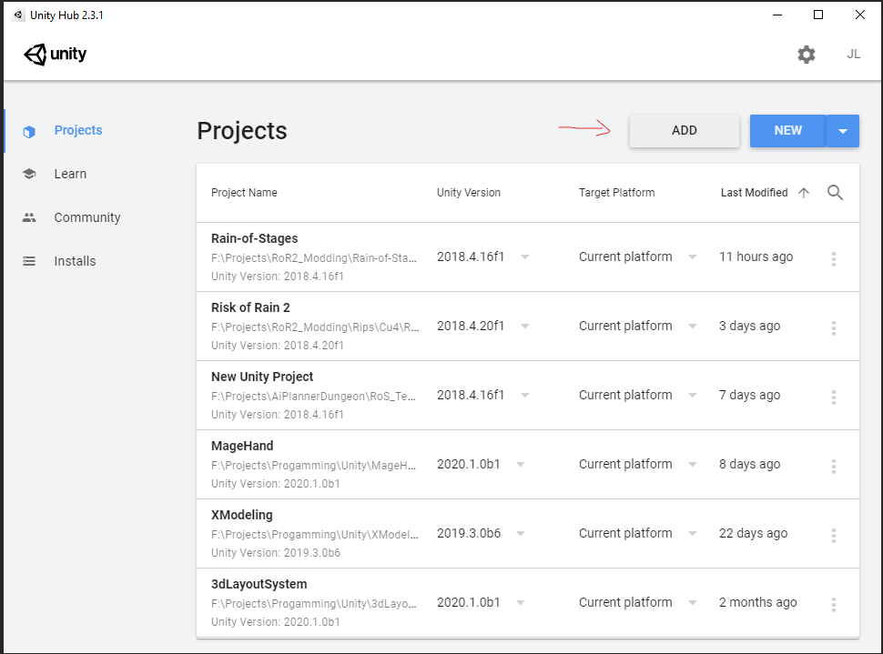
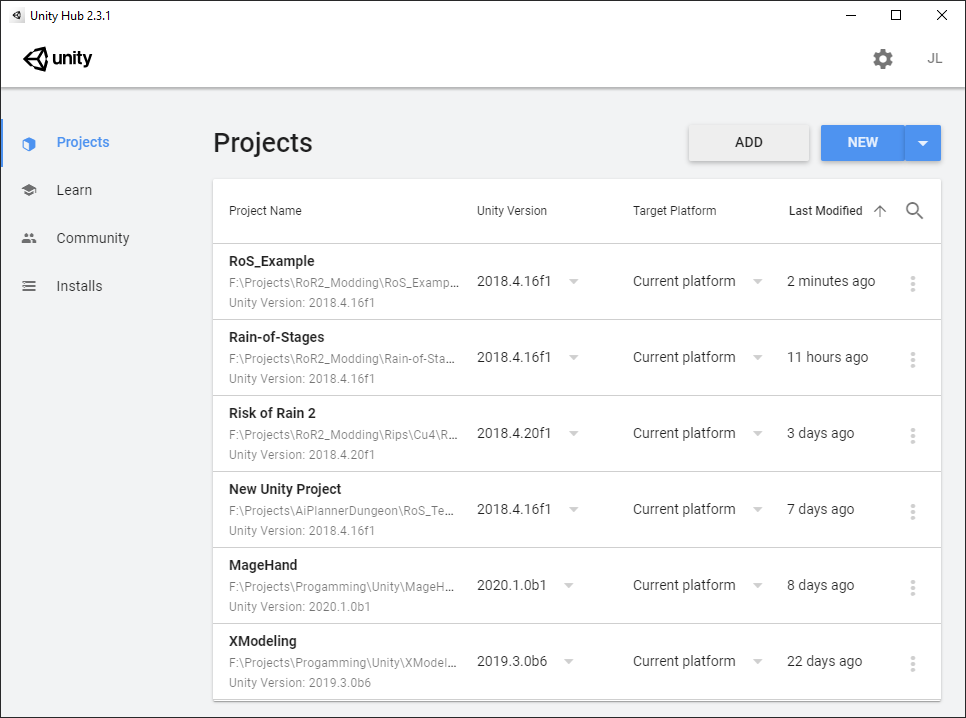
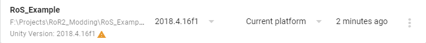
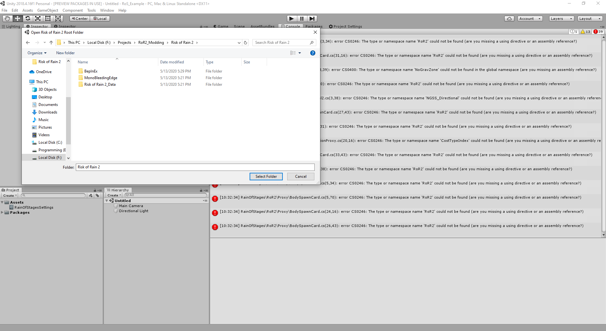
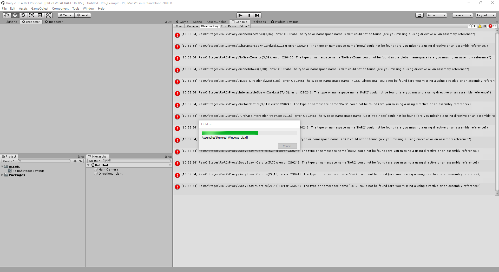
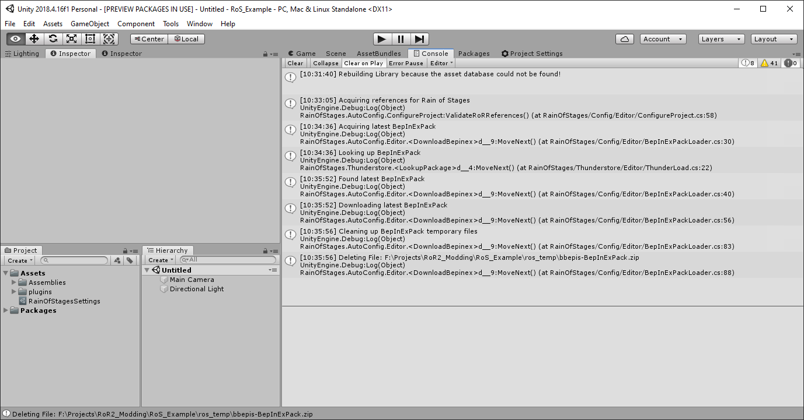

# Setting up Rain of Stages

## Clone Respository

After you've acquired the appropriate tools for developing content with Rain of Stages, you will need to install and configure Rain of Stages.

Rain of Stages attempts to conduct as many configuration steps as possible automatically. No configuration files necessary!

The first step is to download a copy of the Rain of Stages project, this can be done a few ways.

[Clone with Visual Studio](git-client://clone?repo=https://github.com/PassivePicasso/Rain-of-Stages){: .btn }
  * You must have a copy Of Visual Studio 2019 Community Edition or greater and GitHub for Visual Studio installed for this link to work.

[Clone with GitHub for Windows](github-windows://openRepo/https://github.com/PassivePicasso/Rain-of-Stages){: .btn }
  * I don't use GitHub for Windows, so please submit a PR to the gh-pages branch of Rain of Stages to provide instructions here.

[Download Zip](https://github.com/PassivePicasso/Rain-of-Stages/archive/master.zip){: .btn }
  * Extract this Zip into a folder anywhere on your computer and remember where you placed it.  We will open this later with Unity Hub.

## Open with Unity Hub

Once you've downloaded or cloned a copy of Rain of Stages you can open it in Unity using the Unity Hub.

1. Launch Unity Hub now, and then Add the project using the Add button.

Locate and select the folder you cloned or extracted the Rain of Stages project into.

Once located you will find your project listed in Unity hub with the name of the folder you placed the project in.

If Unity was not installed correctly, then you may see a warning icon under the project like below.

If you encounter this, please refer back to the Unity 3D installation step on the [Tools and Resources](./tools-and-resources#unity3d) page.

Now open your new Rain of Stages project by clicking on the new entry in the Projects list.

## Unity Setup

When Unity loads the Rain of Stages project for the first time, and any time the specified Risk of Rain 2 directory is no longer found, Rain of Stages will prompt you to locate your Risk of Rain 2 installation.

Once located, Rain of Stages will copy in its dependencies from your Risk of Rain 2 installation as well as download the current version of BepInEx from http://thunderstore.io

Once all dependencies are copied in Unity will load the remainder of the environment.  This will take some time.

Now your Rain of Stages setup is complete, it should look like the image below, if it does you're ready to begin making custom stages and content
If it does not, review the process and verify you've installed the correct version of Unity, and verify that your Assets/Assembliies and Assets/plugins folders have been populated.

