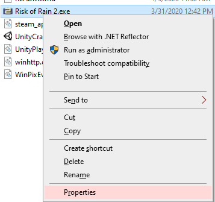
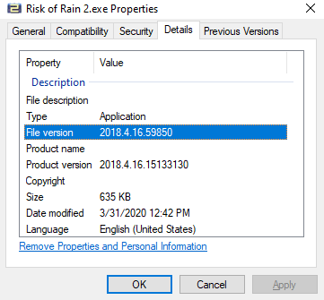
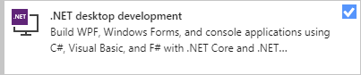
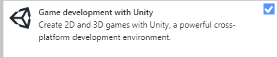

## Unity Hub

Unity Hub provides the ability to manage your Unity 3D Installations and Unity Projects with a simple interface.
It also provides access and links to learning resources to expand your knowledge and understanding of the environment.

The following button will bring you to the Unity Hub for Unity Personal download page

[Download Unity Hub](https://store.unity.com/download?ref=personal){: .btn }

## Unity3D

To use Rain of Stages you must install the correct version of Unity3D.

If you've installed Unity Hub already, use the table below to download the correct verison of Unity 3D with it.

{: .unity-version-table }
Risk of Rain 2 Version | Unity Version | Unity Release Notes | Install
:---------------------- | :------------- | :--- | :---
 Content Update 4 | 2018.4.16f1 | [Release Notes](https://unity3d.com/unity/whats-new/2018.4.16f1){:.btn .btn-blue } | [Install with Unity Hub](unityhub://2018.4.16f1/e6e9ca02b32a){:.btn .btn-green } 

 > Download Links sourced from [Unity Download Archive](https://unity3d.com/get-unity/download/archive){: .btn .buffer-top }

If the version of Unity you need is not listed here, you can find the correct Unity version by looking at your game executable's properties.

The File version indicates the correct version of Unity, as you can see here the version is 2018.4.16.59850  
You may also notice the version number doesn't match, just get as close as you can, if you match the first 3 numbers you're probably on the right version.

## Integrated Development Environment (IDE) 
IDEs will help you add custom code to your deployments.

Visual Studio Code and Visual Studio Community edition can be installed with Unity extension which will improve your development experience.

If you're installing Visual Studio for the first time, make sure to select the following Work Loads during your install for the best experience.

[Get Visual Studio](https://visualstudio.microsoft.com/){: .btn }

## Git
Git is a Version Control System, this allows you to save your work on Github and maintain a history of your changes.

Git can also be used to download a copy of Rain of Stages

[Git for Windows](https://gitforwindows.org/){: .btn }
[GitHub Extension for Visual Studio](https://visualstudio.github.com/){: .btn }

## uTinyRipper
uTinyRipper can be used to extract assets such as Textures, Sounds, and Models from Risk of Rain 2 and other Unity Engine games.

[uTinyRipper on GitHub](https://github.com/mafaca/UtinyRipper){: .btn}

## dnSpy
dnSpy will assist in debugging any custom code you write, Risk of Rain 2 code, or other code from other Managed libraries.

[dnSpy on GitHub](https://github.com/0xd4d/dnSpy){: .btn}
